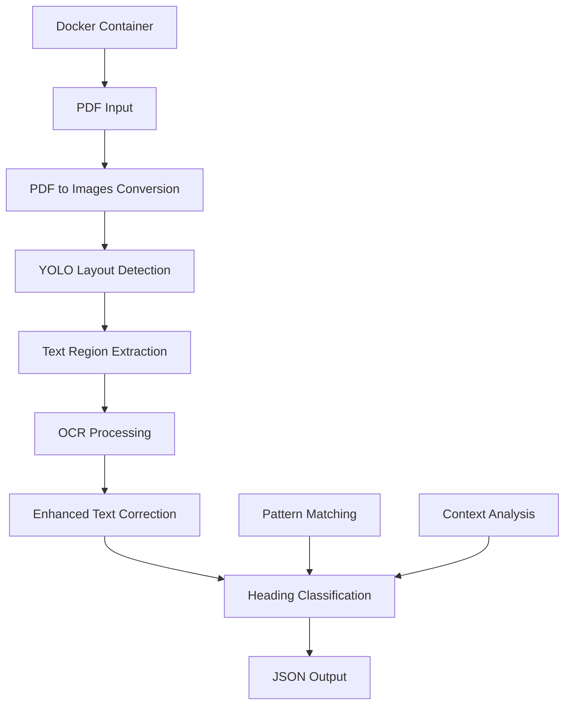
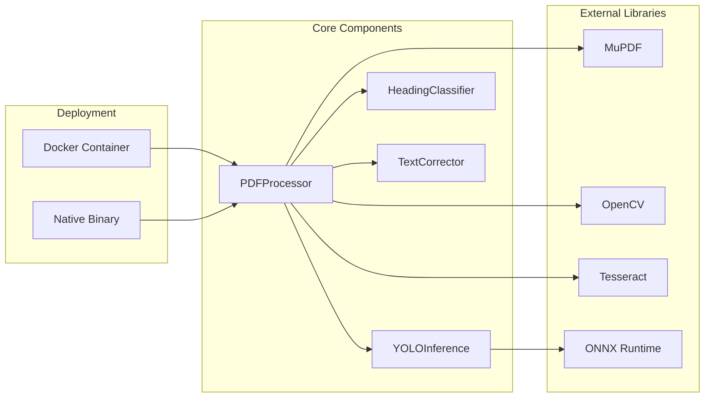
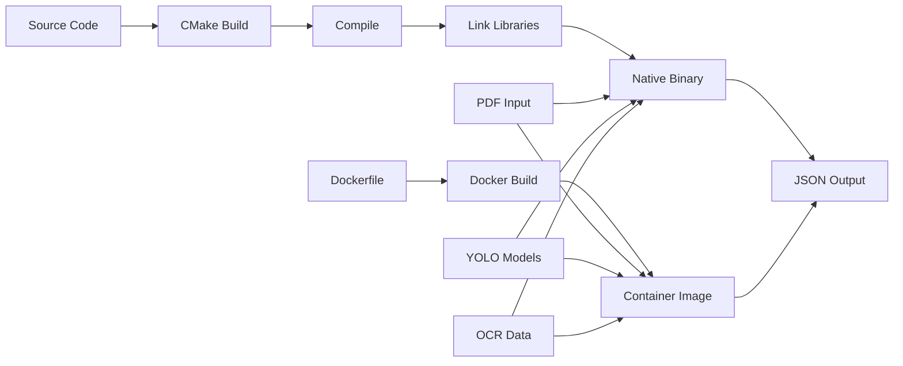

# PDF Heading Extractor in C++

A high-performance C++ application for extracting and classifying headings from PDF documents using AI-powered layout detection, OCR technologies, and advanced text correction.

## Overview

This project implements an intelligent PDF processing pipeline that combines computer vision, machine learning, and optical character recognition to automatically detect and classify document headings. The system features comprehensive OCR error correction and can be deployed via Docker for maximum portability.



## 🚀 Quick Start with Docker (Recommended)

### Build and Run
```bash
# Build the Docker image
docker build -t pdf-processor .

# Process a PDF document
docker run --rm -v $(pwd):/workspace pdf-processor /workspace/your-document.pdf

# Custom output and settings
docker run --rm -v $(pwd):/workspace pdf-processor \
  --dpi 150 -o /workspace/results.json /workspace/your-document.pdf
```

## Table of Contents

- [🚀 Quick Start with Docker](#-quick-start-with-docker-recommended)
- [⚡ Approach](#-approach)
- [🏗️ Architecture](#️-architecture)
- [🛠️ Models and Libraries Used](#️-models-and-libraries-used)
- [✨ Features](#-features)
- [🔧 Native Build and Run](#-native-build-and-run)
- [📄 Output Format](#-output-format)
- [⚡ Performance Characteristics](#-performance-characteristics)
- [🔍 Troubleshooting](#-troubleshooting)
- [🔄 Development Workflow](#-development-workflow)
- [🤝 Contributing](#-contributing)
- [👥 Contributors](#-contributors)
- [📄 License](#-license)

## ⚡ Approach

### Processing Workflow

1. **PDF Conversion**: Convert PDF pages to high-quality images using MuPDF
2. **Layout Detection**: Use YOLO models to identify text regions, titles, and other document elements
3. **OCR Processing**: Extract text from detected regions using Tesseract
4. **Enhanced Text Correction**: Apply comprehensive OCR error correction including:
   - Character-level fixes (rn→m, vv→w, 0→O, 1→l, etc.)
   - Word-level corrections (tlie→the, witli→with, etc.)
   - Technical term fixes (Prograrnming→Programming, Softvvare→Software)
   - Punctuation and formatting corrections
   - Regex-based pattern fixes
5. **Heading Classification**: Classify extracted text into heading levels (H1, H2, H3, H4) using:
   - AI-based layout analysis
   - Rule-based pattern matching
   - Document structure analysis
   - Context-aware classification
6. **Output Generation**: Generate structured JSON with heading hierarchy

### 🏗️ Architecture



## 🛠️ Models and Libraries Used

### AI Models
- **YOLO Layout Detection**: Custom ONNX model (`models/yolo_layout/yolov12.onnx`)
- **Document Layout Analysis**: Optimized for heading detection
- **Support**: ONNX Runtime with CPU inference

### Core Libraries

| Library | Version | Purpose |
|---------|---------|---------|
| **OpenCV** | 4.12.0+ | Image processing, DNN inference |
| **MuPDF** | 1.26.3+ | PDF parsing and rendering |
| **Tesseract** | 5.5.1+ | Optical Character Recognition |
| **ONNX Runtime** | 1.22.1+ | ONNX model inference |
| **nlohmann/json** | 3.12.0+ | JSON processing |
| **Leptonica** | 1.85.0+ | Image processing support |

### System Dependencies
- **CMake** 3.16+
- **C++17** compiler (GCC/Clang)
- **pkg-config** for library detection
- **Docker** (optional, for containerized deployment)

## ✨ Features

### 🎯 AI-Powered Detection
- ✅ YOLO-based layout detection for precise region identification
- ✅ ONNX model support for cross-platform compatibility
- ✅ Intelligent heading classification using contextual analysis
- ✅ Table detection to avoid misclassification

### 🚀 Performance Optimizations
- ✅ Sequential processing for memory efficiency
- ✅ Optimized compilation flags (`-O3`, `-march=native`)
- ✅ CPU-only inference for maximum compatibility
- ✅ Smart caching and preprocessing

### 🔤 Advanced Text Processing
- ✅ **Comprehensive OCR Error Correction**:
  - Character confusions (rn→m, vv→w, 0→O, 1→l, 5→S, 8→B)
  - Word-level fixes (tlie→the, witli→with, tliat→that)
  - Technical terms (Prograrnming→Programming, Softvvare→Software)
  - Common misspellings (recieve→receive, seperate→separate)
  - Punctuation and spacing corrections
- ✅ Multi-language OCR support with Tesseract
- ✅ Pattern-based heading validation
- ✅ Context-aware text normalization

### 🐳 Containerization
- ✅ **Docker Support**: Single-stage Arch Linux container
- ✅ **Portable Deployment**: No dependency installation required
- ✅ **Volume Mounting**: Easy file input/output
- ✅ **Production Ready**: Optimized container size (~6.3GB)

## � Native Build and Run

### Prerequisites

#### Ubuntu/Debian
```bash
sudo apt update
sudo apt install -y \
    cmake build-essential pkg-config \
    libopencv-dev \
    libmupdf-dev \
    tesseract-ocr libtesseract-dev libleptonica-dev \
    nlohmann-json3-dev libonnxruntime-dev
```

#### Arch Linux
```bash
sudo pacman -S cmake gcc pkgconf \
    opencv mupdf tesseract tesseract-data-eng \
    leptonica nlohmann-json onnxruntime
```

### Building the Project

1. **Clone and navigate**:
```bash
git clone https://github.com/sppidy/adobe-1a-cpp
cd adobe-1a-cpp
```

2. **Build**:
```bash
mkdir build && cd build
cmake -DCMAKE_BUILD_TYPE=Release ..
make -j$(nproc)
```

### Running the Application

#### Basic Usage
```bash
./pdf_processor document.pdf
```

#### Advanced Options
```bash
# Custom DPI and output file
./pdf_processor --dpi 150 --output results.json document.pdf

# Verbose mode for debugging
./pdf_processor --verbose document.pdf

# Show help and version
./pdf_processor --help
./pdf_processor --version
```

### 📄 Output Format

The application generates a structured JSON file with corrected heading text:

```json
{
  "title": "Document Title",
  "outline": [
    {
      "level": "H1",
      "text": "Chapter 1: Introduction", 
      "page": 1,
      "bbox": [100, 200, 400, 250],
      "confidence": 0.95
    },
    {
      "level": "H2", 
      "text": "1.1 Overview",
      "page": 1,
      "bbox": [120, 300, 380, 340],
      "confidence": 0.87
    }
  ]
}
```

## ⚡ Performance Characteristics

### Processing Speed
- **Small PDFs (≤10 pages)**: <2.5 seconds
- **Medium PDFs (≤50 pages)**: <7.5 seconds 
- **Large PDFs (≤100 pages)**: <15 seconds

### Memory Usage
- **Base memory**: ~200-500 MB
- **Per page**: ~50-100 MB (depending on image size and DPI)
- **Sequential processing**: Constant memory usage
- **Docker overhead**: ~100-200 MB additional

### Accuracy Metrics
- **Heading Detection**: ~85-95% accuracy on well-formatted documents
- **Level Classification**: ~80-90% accuracy with AI models
- **Text Extraction**: Enhanced with comprehensive OCR error correction
- **Text Correction**: 200+ common OCR error patterns fixed automatically

## 🔍 Troubleshooting

### Docker Issues

1. **Container build fails**:
   ```bash
   # Check available space
   df -h
   
   # Clean old images
   docker system prune -a
   ```

2. **Volume mounting issues**:
   ```bash
   # Use absolute paths
   docker run --rm -v /absolute/path:/workspace pdf-processor file.pdf
   ```

### Native Build Issues

1. **MuPDF not found**:
   ```bash
   # Ubuntu/Debian
   sudo apt install libmupdf-dev
   
   # Arch Linux
   sudo pacman -S mupdf
   ```

2. **ONNX Runtime missing**:
   ```bash
   # Ubuntu/Debian
   sudo apt install libonnxruntime-dev
   
   # Arch Linux
   sudo pacman -S onnxruntime
   ```

3. **Model files not found**:
   ```bash
   # Ensure YOLO model exists
   ls -la models/yolo_layout/yolov12.onnx
   ```

### Feature Verification

Check if all features are enabled:
```bash
# Docker
docker run --rm pdf-processor --version

# Native
./pdf_processor --version
```

Expected output:
```
PDF Processor C++ Implementation
Version: 1.0.0
Built: Jul 29 2025 12:00:00

Features:
  ✓ MuPDF support
  ✓ ONNX Runtime support  
  ✓ OpenCV 4.12.0
  ✓ Sequential processing only
```

## 🔄 Development Workflow



### Key Components

- **Text Correction Engine**: 200+ OCR error patterns with regex support
- **YOLO Integration**: ONNX model inference for layout detection  
- **Containerization**: Docker support for easy deployment
- **Cross-platform**: Works on Linux distributions (Ubuntu, Arch, etc.)

## 🤝 Contributing

1. Ensure all dependencies are properly installed
2. Follow C++17 standards and modern practices
3. Add comprehensive error handling
4. Update documentation for new features
5. Test with various PDF formats and languages
6. Consider both native and Docker deployments

### Development Setup
```bash
# Native development
mkdir build && cd build
cmake -DCMAKE_BUILD_TYPE=Debug ..
make -j$(nproc)

# Docker development
docker build -t pdf-processor:dev .
docker run --rm -v $(pwd):/workspace pdf-processor:dev --help
```

## 👥 Contributors

- [Ravnoor Singh](https://github.com/ravnoorsingh)
- [Ramshouriesh](https://sppidy.in/)
- [Punya K Sirohi](https://www.punyaksirohi.in)

## 📄 License

This project is part of an AI/ML document processing solution. Please refer to the project license for usage terms.

---

## 🚀 Latest Updates

- ✅ **Enhanced OCR Correction**: 200+ error patterns including character confusions, word fixes, and technical terms
- ✅ **Docker Support**: Single-stage Arch Linux container with all dependencies
- ✅ **Improved Performance**: Optimized text processing pipeline
- ✅ **Better Documentation**: Comprehensive USAGE.md and updated README
- ✅ **Production Ready**: Tested containerization with volume mounting

---

**Note**: This implementation focuses on CPU-only inference for maximum compatibility across different systems. The comprehensive text correction engine significantly improves OCR accuracy for heading detection.
